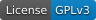
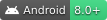
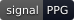
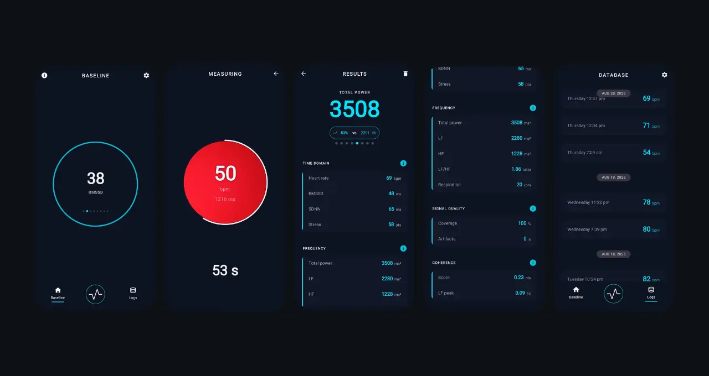

# Lens HRV

<p align="center">
  <a href="LICENSE"></a>
  <a href="#getting-started"></a>
  <a href="#how-the-signal-is-processed"></a>
</p>

<p align="center">
  
</p>

**Lens HRV** is an Android app that measures **heart-rate variability** — how much the time between your heartbeats changes from one beat to the next, measured in **milliseconds**. It uses **Photoplethysmography (PPG)**, a simple optical technique that detects tiny changes in blood flow through your fingertip using only your phone’s camera and flash. Completely non-invasive and requires no extra sensors.

## Why HRV matters
**Heart-rate variability** is more than just a heart measurement.
Over the last decades, research has shown that the small changes between your heartbeats are the result of many different processes happening in the body at the same time.


Your heart does not work alone. It is constantly interacting with events from the rest of the entire body.
— the **nervous system**, the **lungs**, **hormones**, **body temperature**, the **immune system**, **digestion**, **circadian cycles**, **emotions** and more. 

Because of this, **HRV** works like a microscope that lets us observe the state of an interconnected network of organs and systems.

## The current problem
Most HRV apps today work like **closed boxes**.
They are usually paid, require expensive extra sensors, and only show you the final numbers they decide to calculate.
You rarely get access to the **raw signal**.
You cannot see what is really happening or how the metrics were obtained.
Even worse, many of these apps oversimplify the body’s physiological state into a single score or color.

Today anyone can measure HRV. It does not require powerful equipment, works well even on low-end and older smartphones that most people already own, and is now easier than measuring your weight with a scale you have to buy. Yet it is still not truly democratized — most apps limit this rich signal to simple **stress and recovery** scores, instead of inviting people to explore the science behind it.


## What makes Lens HRV different
**Lens HRV** is completely **open source**.
Every algorithm it uses comes from publicly available, peer-reviewed research, and the entire processing pipeline is transparent.
The focus is on **classic digital signal processing** instead of heavy artificial intelligence. This keeps the app lightweight, understandable, and able to run on a wide range of devices.
In the **foss** build, all data is processed directly on your phone — nothing is sent to the cloud. You keep full **privacy** and full **control**.

The app does not offer “readiness” scores. That kind of metric is considered too complex and often oversimplified.
Instead, Lens HRV focuses on clear and simple measurements. The goal is to provide a **frictionless tool** that is accessible to everyone.

## How it works
**Lens HRV** works like most camera-based PPG apps.
Place your **index finger** over the camera lens (preferably the index finger). You can cover the flash or leave it uncovered — what matters is that the entire lens is fully covered until the preview turns a deep red.
The app first runs a short **calibration**. Once the camera is stable, it starts recording the light pulse from your fingertip.
Keep your finger still, but do not try to freeze it. A natural small tremor is fine. What hurts the signal is a sudden movement or a sharp change in pressure. With a little practice, the process becomes very intuitive.
While you measure, the screen shows a live preliminary of bpm and beat-to-beat interval.
When the recording finishes, the app processes the full signal **offline**. Accuracy improves a lot compared to the live detector. The metrics are then shown on screen. If the signal was of poor quality, an alert is shown.

**Note:**
The current preset works well under normal conditions (indoor light, room temperature, light finger contact). Extreme situations like strong outdoor light or large temperature changes are not fully handled.

## What you get
**Lens HRV** shows a clear set of metrics. Some belong to the **time domain** (based on the differences between heartbeats) and others to the **frequency domain** (based on the patterns of those differences over time).

### Time domain
- **Heart Rate** — Average number of beats per minute during the recording.
- **RMSSD** — Shows how much the time between one heartbeat and the next changes. Higher values are usually linked to better recovery and health.
- **SDNN** — Shows the overall variation of all heartbeats in the recording. Higher values generally indicate greater flexibility of the system.
- **Stress Index** — A simple index based on the distribution of heartbeat intervals. Higher values usually point to higher tension in the system.

### Frequency domain
- **Total Power** — The total amount of variation found in the signal across all frequencies.
- **LF** — Power in the low-frequency range of the signal.
- **HF** — Power in the high-frequency range of the signal.
- **LF/HF** — Ratio between the low and high frequency components. It gives a simple view of the balance between both ranges.
- **LF Peak** — The main frequency found inside a specific resonance range of the low-frequency band
- **Respiration rate** — Estimated number of breaths per minute extracted from the signal.
- **Coherence Score** — Shows how steady your heart rhythm was. Higher values usually appear during calm, even breathing, not in every situation.

### Signal quality
Each session also shows **artifacts** and **coverage**. Below 5% is excellent, below 15% is good, and 15% or more is invalidated.

### Baseline
After each session, Lens HRV compares today’s metrics with your **baseline**: the **median** of a rolling **7-day** window. The current session is part of that window.

This is not a readiness or recovery score. It only shows how the current recording sits next to your recent measurements — heart rate, RMSSD, SDNN, Stress Index, Total Power, LF, HF and LF/HF.

Only sessions with **under 15% artifacts** are included. A noisy session — **15% or more** — is still calculated and shown, but it does not enter the window and is **not compared** against the baseline.

### Export
A button in **Settings** exports your measurement database as **CSV** files packed in a ZIP. The archive includes the calculated metrics and the raw channel values from each session, so you can open them in any spreadsheet or analysis tool.

## Getting Started

### Requirements

- **Android Studio**: Quail 2 (2026.1.2) or newer
- **JDK**: 17 to compile the app. Gradle itself runs on **JDK 21** — the wrapper downloads that toolchain on the first build, so you do not need to install it yourself.
- **Device**: Physical Android phone with Android 8.0 (API 26) or higher  
- Must have a rear **camera** and **flash**.

### 1. Clone the repository

```bash
# HTTPS — works without extra setup
git clone https://github.com/LensHRV/lenshrv-app.git

# SSH — if you already have a GitHub SSH key
git clone git@github.com:LensHRV/lenshrv-app.git

cd lenshrv-app
```
### 2. Open the project

Open the project folder in **Android Studio** and wait for Gradle to finish syncing. The IDE writes `local.properties` with your Android SDK path. If you build from the command line, create that file in the project root with `sdk.dir=/path/to/Android/Sdk`.

### 3. Build variants

The project has two flavors. Each one includes a **debug** and a **release** build.

| Flavor | debug | release | applicationId (release) |
|--------|--------|---------|-------------------------|
| **foss** | `fossDebug` | `fossRelease` | `com.lenshrv.foss` |
| **samsung** | `samsungDebug` | `samsungRelease` | `com.lenshrv.samsung` |

Debug builds add the `.debug` suffix to the package name, so all variants can be installed on the same phone without overwriting each other.

- **foss** is the default and the recommended option for normal use. Prefer **`fossRelease`** for a clean and optimized install.
- **samsung** is not intended for regular installation. It exists so the exact code published on the Galaxy Store can be audited and reviewed.

To build the recommended version:

- Open **Build > Select Build Variant** and choose `fossRelease`
- Or run:

```bash
./gradlew assembleFossRelease
```
This produces an installable APK. Release is signed with the IDE debug key so you can install it right away — the fastest way to build from source.

The current app is also available as a ready APK in the **Releases** section of this repository.
## How the signal is processed

**Lens HRV** records the full signal first and only processes the reported metrics when the recording ends. This **offline** approach is more accurate than the live detector.

### 1. Signal acquisition
The rear camera is configured for a fixed **640×480** resolution at **30 fps** with the torch enabled. From each frame the app extracts the **green** channel of the YUV image and computes the average value inside a central **125×125 ROI**. These green samples, together with their precise timestamps, form the raw PPG signal. The **red** channel is used only to check that the finger is covering the lens. During calibration the app locks the detected auto-exposure and white balance before recording starts. The app captures **127 seconds** of data and later analyzes a **120-second** window.

### 2. Filtering and resampling
The raw signal is filtered with a zero-phase **Butterworth band-pass filter** (0.5–8 Hz, order 2 applied forward and backward). It is then resampled to a uniform **250 Hz** grid using natural cubic splines. This higher sampling rate improves the precision of peak detection.

### 3. Beat detection
Systolic peaks are detected with the classic **Elgendi algorithm** (two moving averages on the squared positive signal). A median-based gate removes physiologically implausible intervals.

### 4. Time-domain analysis
From the cleaned RR intervals the app calculates:
- **Heart Rate**
- **RMSSD**
- **SDNN**
- **Baevsky Stress Index**

### 5. Frequency-domain analysis
Two extra steps are applied only for the spectral part. Missing beats are first interpolated with **cubic Hermite polynomials** so the series remains continuous. Then a **smoothness-priors detrend** (λ = 500), based on the approach used in Kubios, removes the slow trend. The power spectrum is estimated with the **Lomb–Scargle periodogram** on the unevenly sampled beats. From this spectrum the following features are extracted:
- **Total Power** (LF + HF)
- **LF** (0.04–0.15 Hz) and **HF** (0.15–0.40 Hz)
- **LF/HF** ratio
- **Respiration rate** (from the HF peak)
- **LF Peak** (main frequency in the 0.04–0.12 Hz resonance range)
- **Coherence Score**

**Signal quality**

**Artifacts** measures how many beats were missing and had to be filled in during the 120-second window.

After detecting the real beats, any large gaps are interpolated. The percentage of these **synthetic beats** is reported as artifacts.

| Artifacts | Grade       | Meaning                            |
|-----------|-------------|------------------------------------|
| < 5%      | Excellent   | Almost no missing beats            |
| < 15%     | Good        | Acceptable number of filled beats  |
| ≥ 15%     | Invalidated | Too many missing beats             |

Sessions at **15% or above** are still calculated and shown, but they are marked as less reliable, excluded from the **7-day baseline**, and not compared against it.

**Coverage** is a different metric: it shows whether the first and last beats span the full 120 seconds.

## Disclaimer

**Lens HRV** is a technical tool for personal data tracking and analysis.  
It is **not** a medical device and does not provide medical advice, diagnosis, or treatment.

The metrics are derived from a smartphone camera and signal processing algorithms. They may not be fully accurate and should not be used as a substitute for professional medical care. Always consult a **qualified healthcare professional** for any health-related decisions.

## Contributing

Contributions are welcome.

If you find a bug, have an idea, or want to improve the signal processing, feel free to open an issue or a pull request.

## License

This project is licensed under the **GNU General Public License v3.0**.
